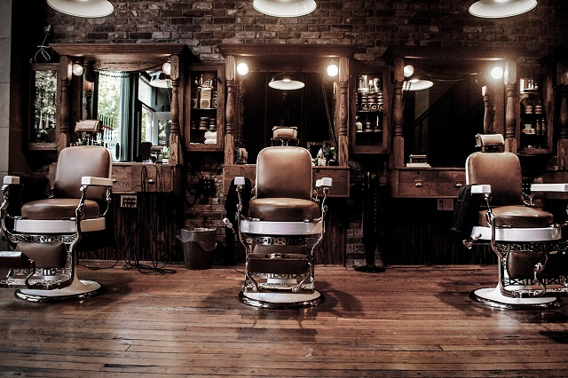

# Cut & Style Barber Shop - Appointment Booking System

A modern, responsive web application for managing appointments at a barber shop. This system provides an intuitive interface for clients to book appointments and track their upcoming bookings.



## Features

- **Clean, Modern UI**: Professional design with a barber shop theme
- **Interactive Calendar**: Easy date selection with visual display of available time slots
- **Real-time Availability**: Time slots update immediately when bookings are made
- **Service Selection**: Choose from various barber services
- **Barber Preference**: Option to select a preferred barber
- **Appointment Management**: View and cancel upcoming appointments
- **Responsive Design**: Fully functional on mobile, tablet, and desktop devices
- **Offline Functionality**: Uses IndexedDB for client-side data storage

## File Structure

```
cut-and-style-barber/
│
├── index.html              # Main HTML file
├── css/
│   └── styles.css          # Main stylesheet
├── js/
│   ├── db.js               # Database handling functions
│   └── app.js              # Main application logic
├── img/
│   ├── barber-shop.jpg     # Hero background image
│   ├── favicon.ico         # Site favicon
│   └── screenshot.png      # Screenshot for README
└── README.md               # Project documentation
```

## Setup Instructions

1. **Clone or download** the repository to your local machine.
2. **Create the folder structure** as shown above.
3. **Copy the files** to their respective locations.
4. **Add images** to the `img` folder:
   - Add a background image named `barber-shop.jpg` for the hero section
   - Optionally add a favicon and other required images

5. **Open index.html** in a modern web browser.

> **Note:** This application uses IndexedDB for local storage. No server setup is required, but all data will be stored in the user's browser.

## Browser Support

The application works best in modern browsers that support IndexedDB:
- Chrome 24+
- Firefox 16+
- Safari 7.1+
- Edge 12+
- Opera 15+

## Customization

### Changing Colors

The color scheme can be easily modified by editing the CSS variables at the top of the `styles.css` file:

```css
:root {
    --primary-color: #d4a150;      /* Gold accent color */
    --secondary-color: #2c3e50;    /* Dark blue/slate color */
    --accent-color: #c0392b;       /* Red accent for buttons/important elements */
    --light-color: #f9f9f9;        /* Light background */
    --dark-color: #333;            /* Dark text color */
}
```

### Adding More Services

To add more service options, edit the select options in the `index.html` file:

```html
<select id="service" required>
    <option value="">Select a service</option>
    <option value="haircut">Haircut</option>
    <option value="haircut-beard">Haircut & Beard Trim</option>
    <!-- Add more options here -->
</select>
```

### Adding More Barbers

To add more barbers, edit the select options in the `index.html` file:

```html
<select id="barber">
    <option value="">No preference</option>
    <option value="james">James</option>
    <option value="michael">Michael</option>
    <!-- Add more options here -->
</select>
```

## Further Improvements

This system could be enhanced with the following features:

1. **User Authentication**: Add login/signup functionality to associate appointments with user accounts
2. **Payment Integration**: Add ability to accept deposits or full payments at booking time
3. **Email Confirmation**: Send confirmation emails when appointments are booked or cancelled
4. **SMS Reminders**: Send text message reminders before appointments
5. **Admin Panel**: Add a protected admin area for staff to manage all appointments
6. **Service Duration**: Account for varying service durations when showing available time slots
7. **Analytics**: Track popular services, peak hours, and other business insights

## License

This project is available for free use under the MIT License.

## Credits

- Font Awesome - for icons
- Google Fonts - for typography
- Your Name - development and design

---

For questions, support, or inquiries, please contact info@cutnstyle.com